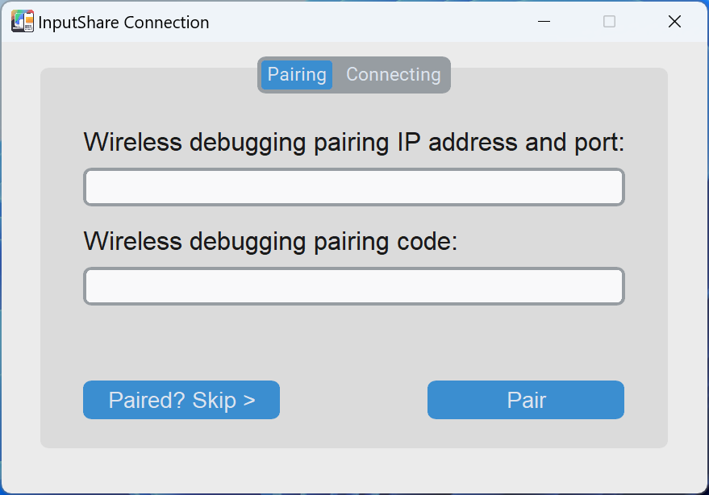
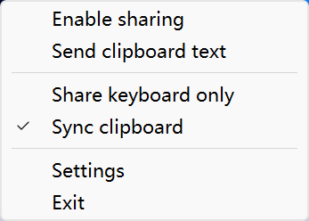

<div align="center">
    <br />
    
    <h1>InputShare</h1>
    <a href="README_zh.md">中文介绍</a> | 
    <a href="https://bhznjns.github.io/InputShare/">Homepage</a> | 
    <a href="https://github.com/BHznJNs/InputShare/issues">Feedback</a>
    <br />
    <br />
</div>

__InputShare__ enables you to share the keyboard and mouse of your computer with an Android device via ADB in wired / wireless way.

## Features

- __Seamless Switching__: Quickly switch keyboard and mouse input between the PC and Android device with hotkey.
- __Wired / Wireless Connection__: Supports both wired and wireless connections for flexible input sharing.
- __Wide Compatibility__: Compatible with various Android devices, not a specific brand.
- __Clipboard Sync__: Seamlessly sync clipboard content between your computer and Android device.
- __Easy-to-Use GUI__

## Screenshots

| Pairing | Connecting | System Tray |
| --- | --- | --- |
|  |  |  |

## Install

Go to the [release page][https://github.com/BHznJNs/InputShare/releases] and download the latest compressed package, uncompress it and the executable is in it.

## Usage

You firstly need to enable the __Developer Settings__ of your Android device.

For wired connection:

1. Enable the __USB Debugging__ in the __Developer Settings__ page
2. Connect your device with computer via a USB cable
3. Just run the executable and skip the pairing and connecting steps
4. Enjoy your mouse and keyboard on Android device

For wireless connection:

1. Enable the __Wireless Debugging__ in the Developer Settings page
2. Run the executable
3. On your Android device: Open __Pair device with pairing code__ option and input the IP address and port and the pairing code into the pairing tab of connecting window (This is the pairing step which is generally needed for the first time use)
4. Input the IP address and port in the main __Wireless Debugging__ into the connecting tab of connection window
5. Enjoy your mouse and keyboard on Android device

## Shortcuts

The shortcuts following are available after connection:

| Shortcut | Description |
| --- | --- |
| `<Ctrl>+<Alt>+s` | toggle the control between your computer and your Android device |
| `<Ctrl>+<Alt>+q` | quit the program |
| `F1` | Multi-task switching |
| `F2` | Return to Home |
| `F3` | Back |
| `F4` | Previous Media |
| `F5` | Play / Pause Media |
| `F6` | Next Media |
| `F7` | Volume Down |
| `F8` | Volume Up |
| `F9` | Brightness Down |
| `F10` | Brightness Up |
| `F11` | Screen Sleep |
| `F12` | Wake Up |

The shortcuts following are available after connection and not sharing:

| Shortcut | Description |
| --- | --- |
| `<Alt>+UP` | Scroll Up |
| `<Alt>+DOWN` | Scroll Down |
| `<Alt>+[` | Previous Media |
| `<Alt>+]` | Next Media |
| `<Alt>+\` | Play / Pause Media |

## FAQ

### How to enable wireless debugging quickly?

You can refer to this video to add the Wireless Debugging to Quick Setting Shortcut:
[How To Add / Remove Wireless Debugging Quick Setting Shortcut](https://www.youtube.com/watch?v=_MMpawUGeKI)

### Does it share the screen of Android device to the computer?

No, __InputShare__ only shares the keyboard and mouse, it will not mirror the screen of your Android device to your computer.

### Do I need to configure ADB by myself?

No, there is a built-in ADB packaged, which will be called automatically.

## Development

Clone this repo:

```bash
git clone https://github.com/BHznJNs/InputShare
cd InputShare
```

Install the requirements with:

```bash
pip install -r requirements.txt
```

Run the entry script:

```bash
python main.py
```

If you want to build this project by yourself, go on:

### Build

Install the pyinstaller:

```bash
pip install pyinstaller
```

Get the `customtkinter` library path

```bash
pip show customtkinter
```

A Location will be shown, for example: `c:\users\<user_name>\appdata\local\programs\python\python310\lib\site-packages`

Use this command to build (replace `<CustomTkinter Location>` with `customtkinter` library path got above):

```bash
pyinstaller --windowed --icon=ui/icon.ico --add-data "./ui/icon.ico;ui/" --add-data "./ui/icon.png;ui/" --add-data "./adb-bin/;adb-bin/" --add-data "./server/scrcpy-server;server/" --add-data "<CustomTkinter Location>/customtkinter;customtkinter/" main.py
```
