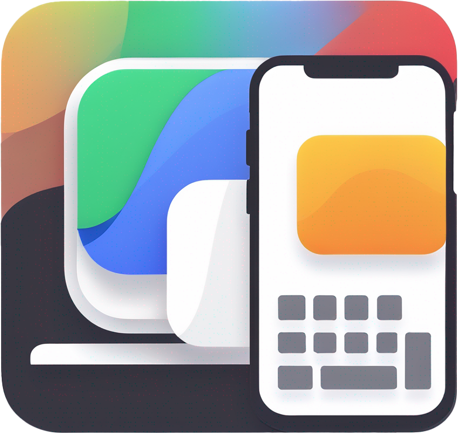
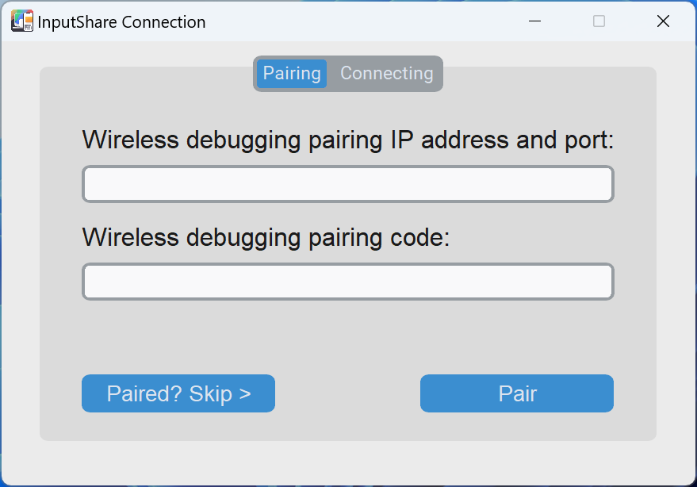
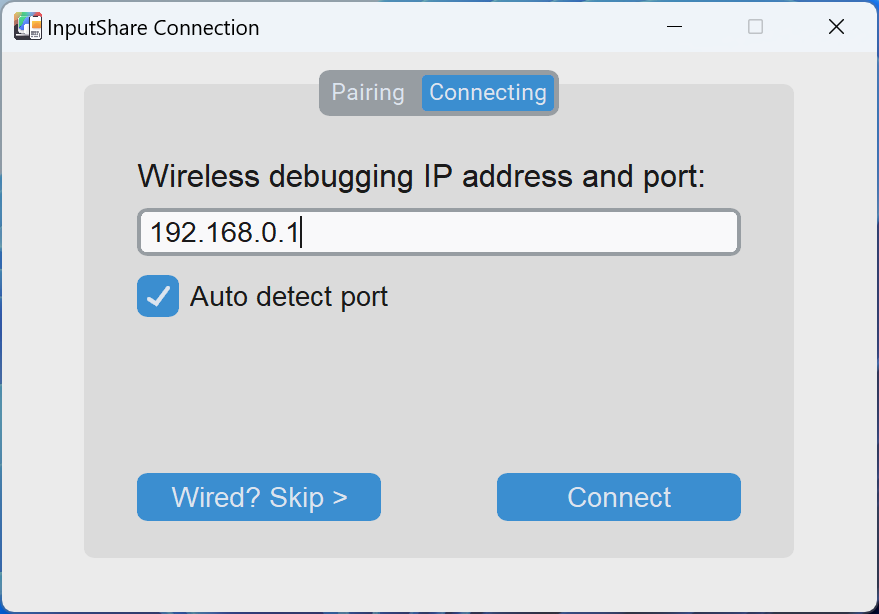
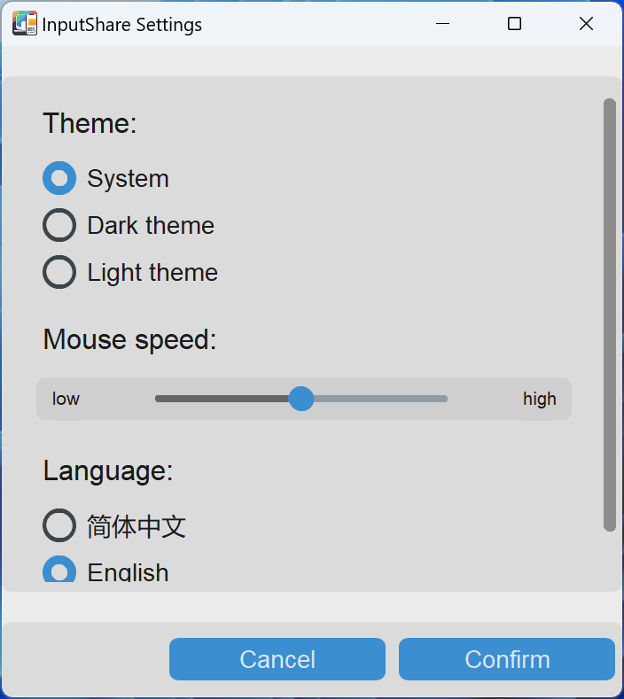
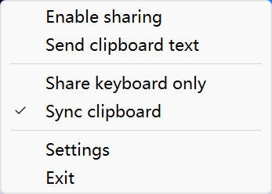

     
    
    <h1>InputShare</h1>
    <a href="README_zh.md">中文介绍</a> |
    <a href="README.md">English</a> |
    <a href="README_ja.md">日本語</a> |
    <a href="README_fr.md">Français</a> |
    <a href="README_es.md">Español</a> |
    <a href="README_ru.md">Русский</a> |
    <a href="README_ar.md">العربية</a>  
    <a href="https://bhznjns.github.io/InputShare/">Homepage</a> |
    <a href="https://github.com/BHznJNs/InputShare/issues">Feedback</a> |
    <a href="https://discord.gg/BwHCxUwnYw">Discord</a>
     
     

__InputShare__ يتيح لك مشاركة لوحة المفاتيح والماوس الخاصة بجهاز الكمبيوتر الخاص بك مع جهاز Android عبر ADB بطريقة سلكية / لاسلكية.

## الميزات

- __التبديل السلس__: قم بتبديل إدخال لوحة المفاتيح والماوس بسرعة بين الكمبيوتر وجهاز Android عبر مفتاح التشغيل السريع وتبديل الحافة.
- __اتصال سلكي / لاسلكي__: يدعم كلاً من الاتصالات السلكية واللاسلكية لمشاركة الإدخال المرنة.
- __توافق واسع__: متوافق مع أجهزة Android المختلفة، وليس علامة تجارية محددة.
- __مزامنة الحافظة__: قم بمزامنة محتوى الحافظة بسلاسة بين جهاز الكمبيوتر وجهاز Android.
- __واجهة مستخدم رسومية سهلة الاستخدام__

## لقطات الشاشة

| الاقتران | الاتصال | الإعدادات | علبة النظام |
| --- | --- | --- | --- |
|  |  |  |  |

## التثبيت

انتقل إلى [صفحة الإصدار](https://github.com/BHznJNs/InputShare/releases) وقم بتنزيل أحدث حزمة مضغوطة، وقم بفك ضغطها وسيكون الملف التنفيذي بداخلها.

## الاستخدام

تحتاج أولاً إلى تمكين __إعدادات المطور__ لجهاز Android الخاص بك.

للاتصال السلكي:

1. قم بتمكين __تصحيح أخطاء USB__ في صفحة __إعدادات المطور__.
2. قم بتوصيل جهازك بالكمبيوتر عبر كابل USB.
3. ما عليك سوى تشغيل الملف التنفيذي وتخطي خطوات الاقتران والاتصال.
4. استمتع بالماوس ولوحة المفاتيح على جهاز Android.

للاتصال اللاسلكي:

1. قم بتمكين __تصحيح الأخطاء اللاسلكي__ في صفحة إعدادات المطور.
2. قم بتشغيل الملف التنفيذي.
3. على جهاز Android الخاص بك: افتح خيار __إقران الجهاز برمز الاقتران__ وأدخل عنوان IP والمنفذ ورمز الاقتران في علامة تبويب الاقتران في نافذة الاتصال (هذه هي خطوة الاقتران التي تكون مطلوبة بشكل عام للاستخدام لأول مرة).
4. أدخل عنوان IP والمنفذ الخاص بـ __تصحيح الأخطاء اللاسلكي__ الرئيسي في علامة تبويب الاتصال في نافذة الاتصال.
5. استمتع بالماوس ولوحة المفاتيح على جهاز Android.

## وثائق المستخدم

- [الاختصارات](./docs/shortcuts_ar.md)
- [الأسئلة الشائعة](./docs/faqs_ar.md)
- [القيود](./docs/limitations_ar.md)
- [التطوير](./docs/development_ar.md)

## شكر وتقدير

InputShare مبني على مشروع [scrcpy](https://github.com/Genymobile/scrcpy) ويوفر واجهة مستخدم رسومية مع استدعاء ADB المدمج.

شكراً لـ [@yxyh357](https://github.com/yxyh357)، الذي حسن أداء InputShare تحت معدل استقصاء عالٍ.
