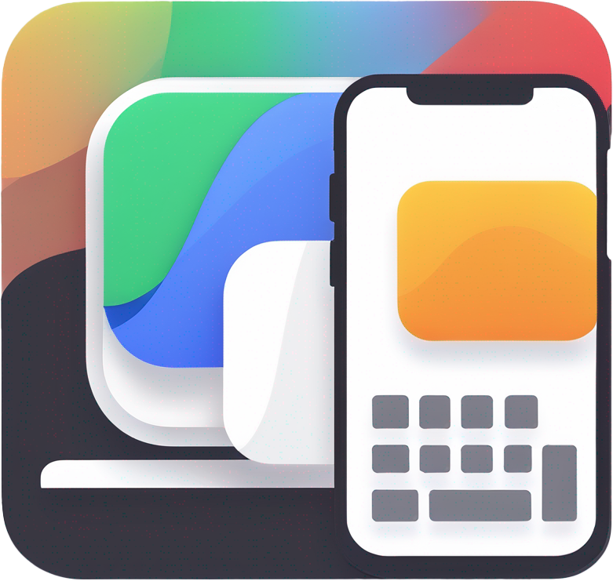

     
    
    <h1>InputShare</h1>
    <a href="README_zh.md">中文介绍</a> |
    <a href="../../README.md">English</a> |
    <a href="README_ja.md">日本語</a> |
    <a href="README_fr.md">Français</a> |
    <a href="README_es.md">Español</a> |
    <a href="README_ru.md">Русский</a> |
    <a href="README_ar.md">العربية</a>  
    <a href="https://bhznjns.github.io/InputShare/">Homepage</a> |
    <a href="https://github.com/BHznJNs/InputShare/issues">Feedback</a> |
    <a href="https://discord.gg/BwHCxUwnYw">Discord</a>
     
     

__InputShare__ は、ADB を介して有線/無線でコンピューターのキーボードとマウスを Android デバイスと共有できるようにします。

## 機能

- __シームレスな切り替え__: ホットキーとエッジトグルを介して、PC と Android デバイス間でキーボードとマウス入力を素早く切り替えます。
- __有線/無線接続__: 柔軟な入力共有のために、有線接続と無線接続の両方をサポートします。
- __幅広い互換性__: 特定のブランドではなく、様々な Android デバイスと互換性があります。
- __クリップボード同期__: コンピューターと Android デバイス間でクリップボードの内容をシームレスに同期します。
- __使いやすい GUI__

## スクリーンショット

| ペアリング | 接続中 | 設定 | システムトレイ |
| --- | --- | --- | --- |
|  |  |  |  |

## インストール

[リリースページ](https://github.com/BHznJNs/InputShare/releases)にアクセスし、最新の圧縮パッケージをダウンロードして解凍すると、実行可能ファイルが含まれています。

## 使用方法

まず、Android デバイスの__開発者向けオプション__を有効にする必要があります。

有線接続の場合：

1. __開発者向けオプション__ページで__USB デバッグ__を有効にします。
2. USB ケーブルでデバイスをコンピューターに接続します。
3. 実行可能ファイルを実行し、ペアリングと接続の手順をスキップします。
4. Android デバイスでマウスとキーボードをお楽しみください。

無線接続の場合：

1. 開発者向けオプションページで__ワイヤレスデバッグ__を有効にします。
2. 実行可能ファイルを実行します。
3. Android デバイスで：__ペアリングコードでデバイスをペアリング__オプションを開き、IP アドレスとポート、およびペアリングコードを接続ウィンドウのペアリングタブに入力します（これは通常初回使用時に必要なペアリング手順です）。
4. メインの__ワイヤレスデバッグ__の IP アドレスとポートを接続ウィンドウの接続タブに入力します。
5. Android デバイスでマウスとキーボードをお楽しみください。

## ユーザー向けドキュメント

- [ショートカット](../../shortcuts/shortcuts_ja.md)
- [よくある質問](../../faqs/faqs_ja.md)
- [制限事項](../../limitations/limitations_ja.md)
- [開発](../../development/development_ja.md)

## 感謝

InputShare は[scrcpy](https://github.com/Genymobile/scrcpy)プロジェクトに基づいており、組み込みの ADB 呼び出しを備えた GUI を提供しています。

高ポーリングレートでの InputShare のパフォーマンスを向上させた[@yxyh357](https://github.com/yxyh357)に感謝します。
